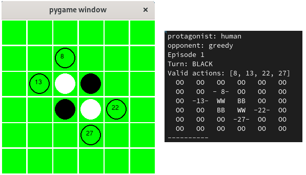

  

# Gymnasium Othello Environment

This repository contains an implementation of [Othello](https://en.wikipedia.org/wiki/Othello) with OpenAI [Gymnasium](https://gymnasium.farama.org/index.html) interfaces. This environment is for researchers and engineers who are interested in developing model-based RL algorithms.

We provide several simple baselines:
1. Random policy
2. Greedy policy
3. [Maximin](https://en.wikipedia.org/wiki/Minimax) policy
4. Human policy
in order to explain how to use the basic env to experiment with RL algorithms.

## Basic Usage

```
#
# -- AI Othello - activation examples --
#
# Play against machine, opponent default Rand policy
python run_ai.py --protagonist='human'
#
# Play against machine with a reduced board size, opponent default Rand Policy
python run_ai.py --protagonist='human' --board-size=6
#
# Play against machine, which use maximin strategy, with a reduced board size
python run_ai.py --protagonist='human' --render-mode='human' --opponent='maximin' --board-size=6 --rand-seed=100
#
# Play against machine, which use random strategy, with a reduced board size
python run_ai.py --protagonist='human' --render-mode='human' --opponent='rand' --board-size=6 --rand-seed=100
#
# Play against machine, which use Greedy strategy, with a reduced board size
python run_ai.py --protagonist='human' --render-mode='human' --opponent='greedy' --board-size=6
#
# Train machine, which use rand strategy, with render mode ansi
python run_ai.py --protagonist='rand' --render-mode='ansi'
#
# Train machine, which use maximin strategy, with a reduced board size
python run_ai.py --protagonist='maximin' --opponent='rand' --board-size=6 --rand-seed=100
```
See `run_ai.py` for examples how to use the environment to integrate your agents.

## How to integrate with GYMNASIUM
To create la package:
```
pip install -e othello_ng
```
To use the package (for a complete example take a look at run_ai.py):
```
import gymnasium
import othello_ai
env = gymnasium.make('othello_ai/Othello-v0', render_mode='ansi', board_size=6, render_in_styep=True)
## start a new game
env.reset()
# next to move
next_move = lambda x: "BLACK" if x == -1 else "WHITE"
next_move(env.unwrapped.env.unwrapped.player_turn)
# possible moves
env.unwrapped.possible_moves
# number of players
env.unwrapped.n_players
```
## Citation
Please use this BibTeX to cite this repository in your publications:
This work is based on the code by Lerry Tang you can find at https://github.com/lerrytang/GymOthelloEnv.
The code was adapted to [PYGAME](https://www.pygame.org) for rendering and to recent implementations of [GYMNASIUM](https://gymnasium.farama.org/index.html) 

```
@misc{gymnasiumothelloenv,
  author = {Pierfrancesco Ghedini},
  title = {OthelloGymnassium},
  year = {2024},
  publisher = {GitHub},
  journal = {GitHub repository},
  howpublished = {\url{https://github.com/pghedini/OthelloGymnasium}},
}
```
